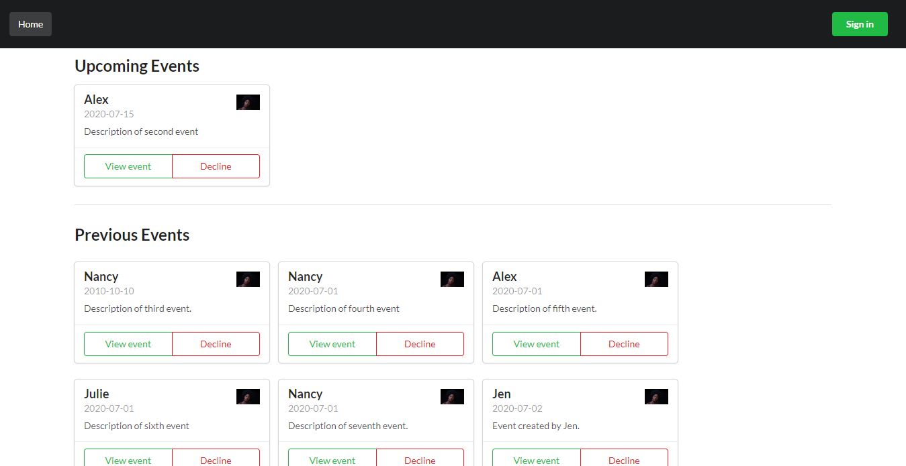

# Private Events

The project builds a site similar to a private [Eventbrite](https://www.eventbrite.com/). It allows users to create events and then manage user signups. 
Users can create events and send event invitations. 
The home page lists all upcoming and past events.





## Built With

- Ruby
- Javascript,
- Ruby on Rails,
- Semantic ui
- RSpec and capybara


## Getting Started


To get a local copy up and running follow these simple example steps.

### Prerequisites

- The project is built using Rails 6 and Ruby-2.6.3
- Install Ruby and Git on local machine


### Setup

- Clone the project into your local machine.
- cd in private-event.
- run ```bundle install```.
- Run ```rails db:migrate```.
- Run ```rails c``` to interact with the database.
- Run ```rails s``` to open the project on the browser.

### Install
- Install yarn using the instructions given [here](https://classic.yarnpkg.com/en/docs/install/#windows-stable). Yarn helps manage javascript files in rails 6.
- Run ```npm install``` to download all the packages listed in the package.json file.


### Run tests
- For model tests: ```bundle exec rspec spec/models/<insert-name-of-file-from-specs/models-folder>```
- For view tests: ```bundle exec rspec spec/features/<insert-name-of-file-from-specs/features-folder>```
- For controller tests: ```bundle exec rspec spec/controllers/<insert-name-of-file-from-specs/controllers-folder>```


## Authors

- Github: [@blackpintz](https://github.com/blackpintz)
- Twitter: [@blackpintz](https://twitter.com/blackpintz)


## 🤝 Contributing

Contributions, issues and feature requests are welcome!

Feel free to check the [issues page](https://github.com/blackpintz/private-events/issues).

## Show your support

Give a ⭐️ if you like this project!

## Acknowledgments

- The Odin Project 
- Eventbrite.


## 📝 License

This project is [MIT](lic.url) licensed.
